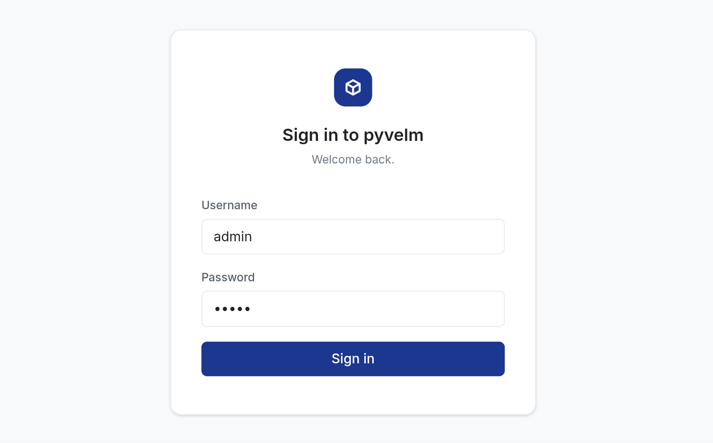
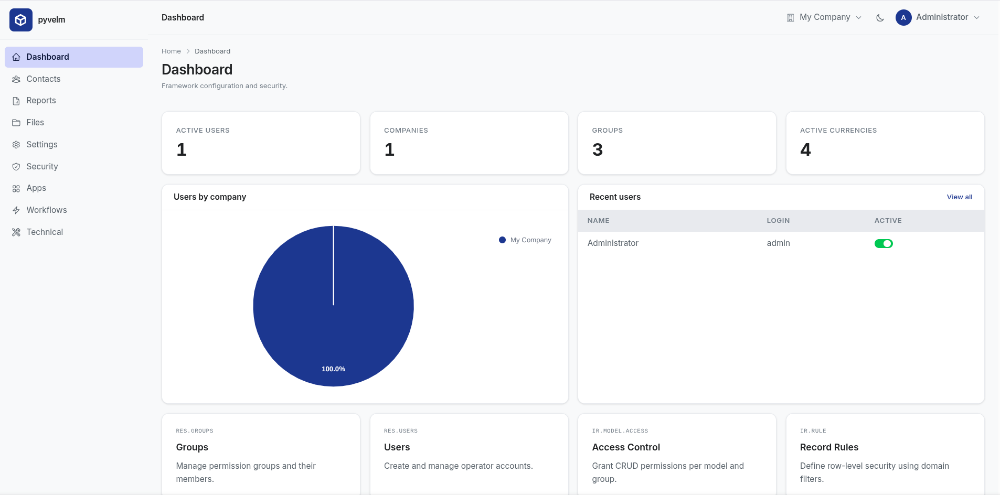
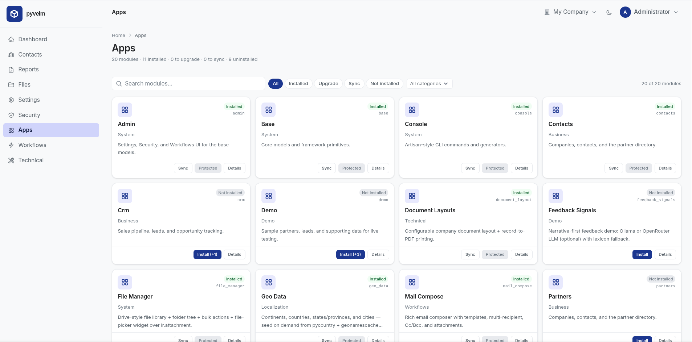
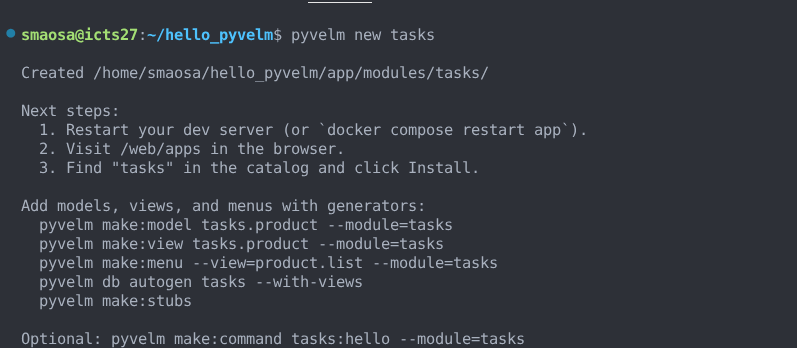
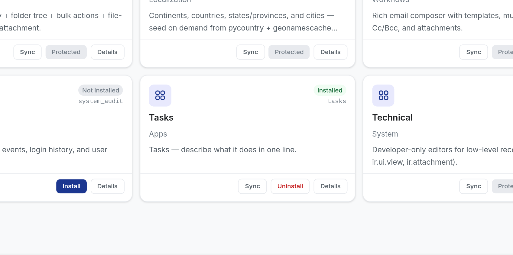
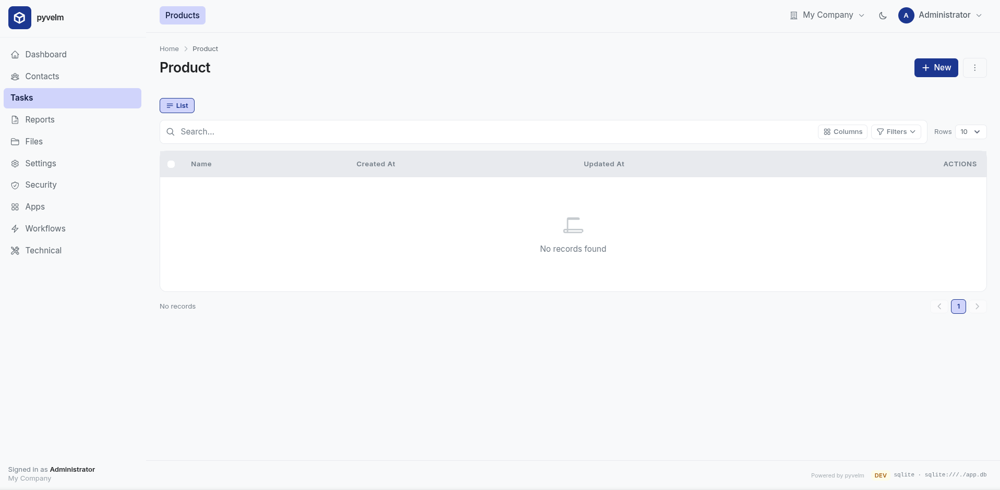

# Getting started

This guide walks from zero to a running PyVELM app with one custom module.

You do not need internal framework knowledge to complete this page. For design
decisions and internals, read [Architecture](architecture.md) later.

## Outcome

By the end, you will:

1. Scaffold a project.
2. Boot it with Docker, a local database, or SQLite.
3. Generate and install your first module.

## Prerequisites

- Python 3.11+ available in your shell.
- Optional but recommended: Docker and Docker Compose.
- A writable project directory.

## 1. Install + scaffold

```bash
# Install pyvelm (pipx keeps it isolated from system python).
pipx install pyvelm

# Scaffold a project. Creates ./my_erp/ with all the wiring.
pyvelm init my_erp
cd my_erp
```

The scaffolder drops a self-contained starter tree — a Dockerfile,
a `docker-compose.yml`, an `app/` directory with the FastAPI boot
script, and `deploy/` templates for systemd + nginx if you want to
deploy bare-metal later. See [CLI → `pyvelm init`](cli.md#pyvelm-init)
for the full tree.

## 2. Boot the app

Choose one path. Docker is the quickest if you want Postgres without local DB setup.
SQLite is fine for quick iteration and tests.

PyVELM supports additional SQLAlchemy dialects (for example MySQL/MariaDB,
SQL Server, and Oracle). This page uses Postgres/SQLite as the shortest
first-run path. For backend matrix and DSN examples, see
[Multi-database support](multi-database.md).

### Path A — Docker

```bash
cp .env.example .env       # adjust passwords for non-toy use
docker compose up --build
```

The compose file runs Postgres, the web app, and a dedicated cron worker.
When the build finishes, open
`http://localhost:8000/login` and sign in as `admin` / `admin`.



*Login page after the first successful boot.*

### Path B — local database + venv (Postgres example)

```bash
cp .env.example .env
# Edit .env so PYVELM_DSN points at a database you control.
# Example below uses PostgreSQL; other supported SQLAlchemy DSNs also work.

python3 -m venv venv
source venv/bin/activate
pip install -e .
python -m app.serve --reload
# → http://localhost:8000/login   (admin / admin)
# → http://localhost:8000/docs     (development mode only)
```

`python -m app.serve` defaults to **development** (`PYVELM_ENV=development`):
OpenAPI docs at `/docs`, debug logging, and no `Secure` cookie requirement.

For **production** locally: `PYVELM_ENV=production python -m app.serve --host 0.0.0.0`
or use gunicorn as in [Deployment](deployment.md).

### Path C — SQLite (no Postgres)

```bash
cp .env.example .env
# Example:
#   PYVELM_DSN=sqlite:////absolute/path/to/var/app.db
#   PYVELM_DSN_TEST=sqlite:////tmp/pyvelm-test.db

python3 -m venv venv
source venv/bin/activate
pip install -e .
pyvelm db migrate --all    # model-driven schema; skips backend-specific SQL scripts when unsupported
python -m app.serve --reload
```

SQLite suits local development and tests. For production, choose a backend that
matches your deployment constraints (PostgreSQL is the reference default).
See [Database layer (v1.0)](multi-database.md).

### What you'll see

A fresh app installs `base` and `admin`, which provide login,
navigation shell, Apps catalog, and admin settings.



*Initial authenticated shell view.*

Depending on configuration, visiting `/` as an anonymous user may show
the public landing page (Get started → login). This is controlled by
`PYVELM_LANDING` (default: enabled). If you disable it, `/` redirects
straight to `/login`.

Click around:

- **Apps** — install / upgrade / uninstall modules. The framework's
  `base` and `admin` are already installed.
- **Settings** — manage users, groups, companies.
- **Security** — model access entries, record rules.
- **Workflows** — server actions, automation rules, cron jobs, the
  mail outbox.



*Apps catalog with bundled modules visible.*

## 3. Add your first module

Run `pyvelm new` inside the project. It auto-detects the module root
from the `pyvelm.toml` marker created by `pyvelm init`:

```bash
pyvelm new tasks
```

This creates an empty shell under `./app/modules/tasks/` (manifest, hooks,
and empty `models/` and `views/`). Then scaffold model/view/menu files:

```bash
pyvelm make:model tasks.todo --module=tasks
pyvelm make:view tasks.todo --module=tasks
pyvelm make:menu --view=todo.list --module=tasks
pyvelm make:stubs
```



*Scaffolding commands creating the module files.*

Make sure those generated view files are referenced in
`app/modules/tasks/__pyvelm__.py` via `.data(...)`:

```python
manifest = (
    Manifest.make("tasks")
    # ...
    .data("views/todo.py", "views/menu.py")
)
```

`make:view` and `make:menu` usually update this for you, but it is worth
verifying before running migrations.

`make:model` scaffolds `class Todo(models.Model)`. Once records exist,
you can query with the fluent API (same ACL path as `search()`):

```python
open_items = env["tasks.todo"].query().where("active", True).order_by("name").get()
```

Apply schema changes and sync module metadata:

```bash
pyvelm db autogen tasks --with-views
pyvelm db migrate
# or: docker compose up   # runs migrate, then app + cron
```

On a fresh database, app boot and `pyvelm db migrate` auto-install only
`base` and `admin`. Install your module with Apps UI, or run
`pyvelm db migrate --module tasks` (or `--all`).



*`tasks` module marked as installed in Apps.*

The Apps page should show `tasks` as **Installed** after migrate. If not,
click **Install**. Once menus are synced, the shell exposes your module.
See [Navigation](navigation.md) for layout behavior.



*New module menu visible in the shell navigation.*

For future model changes, follow [Migrations workflow](migrations.md).

`make:stubs` (above) writes `.pyvelm/typing/` and merges
`pyrightconfig.json` so your editor validates model and view string
literals (including `env.query("tasks.todo")`). See
[IDE typing stubs](ide-typing.md).

See [CLI reference](cli.md#pyvelm-new) for full command options,
including `--in <path>` when working outside an init'd tree.

## What's next

- **[Declaring models](models.md)** — the field reference, computed
  fields, `_inherit` extensions, `super()` chaining, Eloquent-style
  `.query()` builder.
- **[Building UIs](views.md)** — fluent view builders, list / form /
  kanban arches, widgets, search and filtering.
- **[Modules](modules.md)** — `Manifest.make()`, `views_data`, menus.
- **[Form UX](form-ux.md)** — notebooks, Ctrl+S, save toasts, opening
  related records in a dialog.
- **[Extending views](inheritance.md)** — patching another module's
  arches without forking them.
- **[Security](security.md)** — groups, ACL, record rules,
  multi-company.
- **[Deployment](deployment.md)** — Docker layout, gunicorn
  tuning, the cron worker, sending email.
